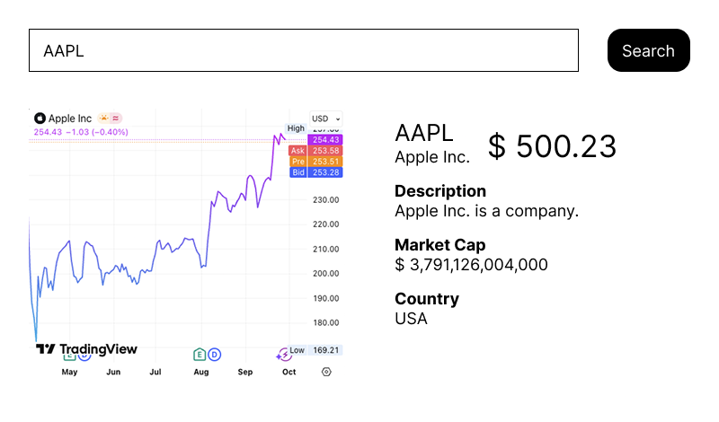

# UI Coding Challenge

## Task

Build a web application that displays public company information and visualizes
their daily stock prices with an interactive chart.
It should have an input where the user can enter the respective ticker (e.g.
IBM, AAPL, etc.)

### Mockup



## API documentation

This repository comes with an API service in `apps/backend`.

Please run `npm install` and `npm run dev` inside and otherwise ignore it's code.

The API server will run on http://localhost:3000 and print your API key on startup.

The API service provides two endpoints for fetching company and stock price data:

- Company Overview: [http://localhost:3000/query?function=OVERVIEW&symbol=IBM&apikey=demo](http://localhost:3000/query?function=OVERVIEW&symbol=IBM&apikey=demo)
- Daily Stock Prices: [http://localhost:3000/query?function=OVERVIEW&symbol=IBM&apikey=demo](http://localhost:3000/query?function=OVERVIEW&symbol=IBM&apikey=demo)

Where the `symbol` parameter is the symbol the user wants to look up.
Please also provide the API key via the `apikey` parameter.

Notice, that it only support following symbols:

```
AAPL, AMZN, CSCO, FB, GOOG, IBM, MSFT, NFLX, NVDA, TSLA
```

## Implementation Requirements

Work within the `apps/frontend` directory, which includes:

- A Vite + React template with Hot Module Replacement (HMR)
- TypeScript support (optional - not required)
- Disabled TypeScript rules and ESLint for flexibility

Feel free to reset the frontend setup entirely if you prefer any other language,
tooling or framework!

**Enjoy!**
